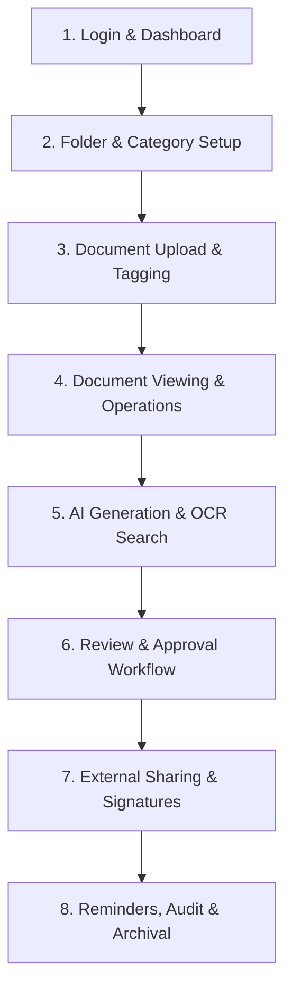

# 📘 Doxcraft Document Management System (DMS)
## Complete Master Step-by-Step User Workflow Guide

---

## 🧭 Master Lifecycle Overview

---

## 📌 Master Step 1: Login & Navigation

### 1.1 Sign In
1. Open the application in any web browser.
2. Enter your **Email/Username** and **Password**.
3. Click **Sign In**. The system loads your personalized workspace based on your assigned role permissions.

### 1.2 Top Bar Controls
* **Sidebar Toggle**: Collapse or expand the left sidebar for full-screen viewing.
* **Fullscreen Mode**: Expand the app to fullscreen.
* **Language Selector**: Switch between English, Arabic (with automatic RTL layout), and other configured languages.
* **Notifications**: Click the bell icon to view real-time notifications, workflow updates, and alerts.
* **Theme Customizer**: Choose between light/dark mode and select your preferred primary brand color.
* **Profile Menu**: Click your avatar to view **My Profile** or securely **Logout**.

---

## 📌 Master Step 2: Dashboard (Daily Hub)

1. **Category Overview Chart**: Review the bar chart showing how many documents exist in each folder/category.
2. **Assigned Workflows Section**: Check the list of document approvals currently waiting for your review.
3. **Calendar View**: Check scheduled document renewals, compliance deadlines, and personal reminders.

---

## 📌 Master Step 3: Folder & Category Setup

### 3.1 Create Categories & Folders
1. Navigate to **My Documents ➔ Folder View** (or **Category / Folder Management**).
2. Click **Add Folder / Add Category**.
3. Enter the **Folder Name**, select a parent folder (if creating a sub-folder), and set access permissions.
4. Click **Save**.

### 3.2 Organize Content
* Expand/collapse folders in the tree view to browse documents department by department.

---

## 📌 Master Step 4: Uploading Documents

### 4.1 Single Document Upload
1. Navigate to **My Documents ➔ Document View** and click **Add Document**.
2. **Select File**: Drag and drop a file (PDF, Word, Excel, Image, etc.) or click to browse.
3. **Fill Details**:
   - Enter **Document Name** and **Description**.
   - Select the target **Category / Folder**.
   - Attach **Meta Tags** (e.g., Client Name, Invoice Number) for quick filtering.
4. Click **Save / Upload**.

### 4.2 Bulk Document Upload
1. Navigate to **Bulk Document Upload** from the sidebar.
2. Drag and drop multiple files at once.
3. Assign a common category/folder or configure metadata per file.
4. Click **Upload All**.

---

## 📌 Master Step 5: Document Viewing & Management Actions

From **Document View**, click the **Action Menu (•••)** on any document:

1. **View / Preview**: Opens the document in the built-in browser previewer (supporting PDFs, Word files, images) without downloading.
2. **Edit Metadata**: Update document title, description, or tags.
3. **Version History**:
   - View past versions of the document.
   - Upload a newer revision while keeping older copies archived for comparison.
4. **Digital Signature**: Add your electronic signature to the document.
5. **Download**: Securely download the document to your local machine.
6. **Archive / Delete**: Send expired documents to the archive or recycle bin.

---

## 📌 Master Step 6: AI Power Tools & Smart Search

### 6.1 AI Document Generator
1. Navigate to **AI Documents ➔ AI Document Generator**.
2. Select a pre-built **Prompt Template** (e.g., *Contract Generator*, *Meeting Summary*, *HR Policy*).
3. Fill in the required parameters (e.g., Party Names, Effective Dates).
4. Click **Generate Document**. The AI drafts the content directly into the editor for review and export.

### 6.2 Deep Content Search
1. Navigate to **Deep Search**.
2. Type any keyword, clause, or invoice number.
3. The search engine scans **inside the body content** of all stored documents and highlights matching results.

### 6.3 OCR Content Extractor
1. Navigate to **OCR Content Extractor**.
2. Upload a scanned image, receipt, or photo of a paper document.
3. Click **Extract Text** to convert the image into editable, searchable text.

---

## 📌 Master Step 7: Approval Workflows

### 7.1 Start a Workflow on a Document
1. Select a document and click **Request Workflow / Send for Approval**.
2. Select a workflow process (e.g., *Two-Level Financial Approval*).
3. Enter comments and click **Submit**.

### 7.2 Review & Take Action (Approver)
1. Navigate to **Assigned Workflows** from the sidebar or dashboard.
2. Click **Detail (Visibility)** to review the document and transition history.
3. Click the required action button:
   - **Approve (Green)**: Advances the document to the next step or finalizes approval.
   - **Reject (Red)**: Sends the document back with rejection notes.
   - **On Hold (Gray)**: Pauses the process pending more information.
   - **Escalate (Orange)**: Forwards the decision to a higher authority.
4. Add a comment and click **Confirm**.

---

## 📌 Master Step 8: External Collaboration (File Request Links)

1. Navigate to **File Request Link**.
2. Click **Create File Request**.
3. Enter a title (e.g., *Vendor Tax Documents*), select the destination folder, and set an expiration date.
4. Copy the generated **Public Link** and send it to the client/vendor.
5. **Client Experience**: The external client opens the link, drags and drops their files, and uploads them directly into your folder without needing an account.

---

## 📌 Master Step 9: Reminders & Alerts

1. Navigate to **Reminder**.
2. Click **Add Reminder**.
3. Select the document, specify the **Date & Time**, and choose who should be alerted.
4. Set recurrence if needed (Daily, Weekly, Monthly).
5. When the date arrives, the system sends an in-app notification and email alert.

---

## 📌 Master Step 10: Compliance, Auditing & Administration

1. **Document Audit Trail**: Open **Document Audit Trail** to view every action taken on a file (who viewed it, downloaded it, edited it, or approved it with exact timestamps).
2. **User & Role Management** *(Admins)*:
   - Create users and assign them to roles (e.g., Admin, Reviewer, Standard User).
   - Configure custom permissions for each page and action.
3. **General & Storage Settings** *(Admins)*:
   - Configure allowed file extensions, max upload sizes, and cloud/local storage destinations.
